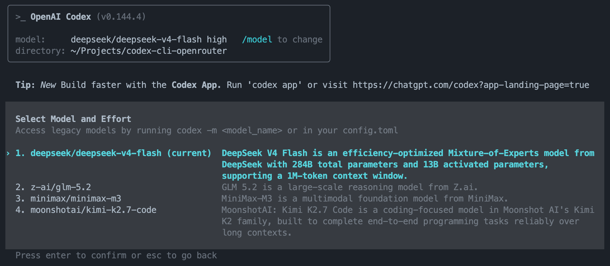
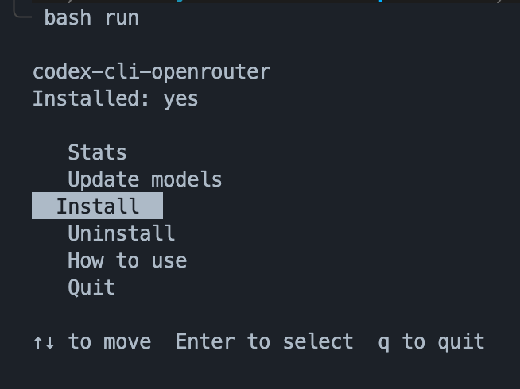
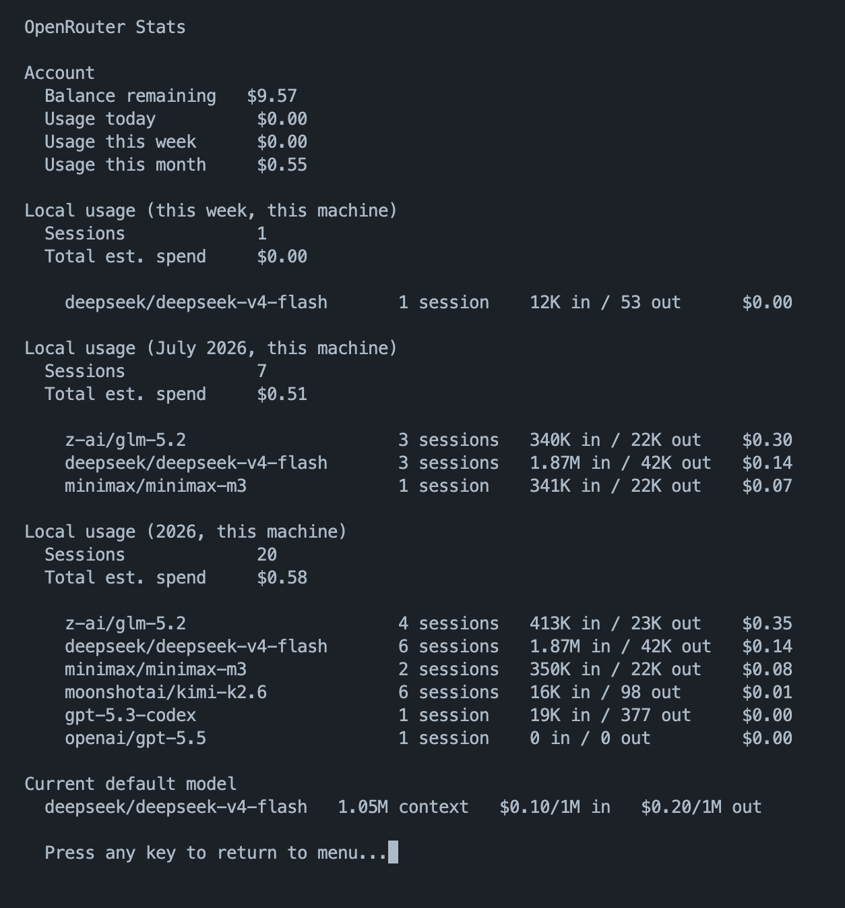

# codex-cli-openrouter

A shell utility that automatically generates a valid `custom-models.json` for the [Codex CLI](https://github.com/openai/codex), enabling any [OpenRouter](https://openrouter.ai) model without the undocumented schema errors that block most attempts. Fetches live metadata from the OpenRouter API and overlays it onto a template extracted from the Codex binary itself, so the schema stays correct through Codex updates.




## The problem

Using Codex CLI with non-OpenAI models via OpenRouter is extremely common. Developers want access to the full OpenRouter catalog (Kimi, Gemini, Claude, DeepSeek, and hundreds more) without being locked into OpenAI models. OpenRouter even has an [official Codex CLI integration page](https://openrouter.ai/docs/community/codex).

The catch: Codex's `model_catalog_json` has a strict JSON schema with ~20 required fields, none of which are documented. Every attempt to write a custom catalog by hand results in a `missing field` error, one field at a time. This is a well-travelled path with a poorly documented sharp edge.

## The solution

This repo generates a valid `custom-models.json` automatically by:

1. Running `codex debug models --bundled` to extract a real, valid model entry from the Codex binary as a template — so the schema is always correct, even after Codex updates
2. Fetching live metadata for your chosen model slugs from the [OpenRouter public API](https://openrouter.ai/api/v1/models) (no auth required)
3. Overlaying the OpenRouter metadata (slug, display name, description, context window) onto the template
4. Writing the result to `~/.codex/custom-models.json`

No hardcoded schema. No npm. No pip. Just `bash` and `python3`.


## Prerequisites

- [`codex` CLI](https://github.com/openai/codex) installed and in your PATH
- `python3` (standard on macOS and Linux)
- An [OpenRouter API key](https://openrouter.ai/keys)

Works on macOS and Linux. Windows users need [WSL](https://learn.microsoft.com/en-us/windows/wsl/install).


## One-time setup

**1. Clone this repo**

```bash
git clone https://github.com/nvco/codex-cli-openrouter.git
cd codex-cli-openrouter
```

**2. Edit your model list**

Open `custom-models.txt` (in the repo you just cloned) in any editor. One OpenRouter slug per line — blank lines and `#` comments are ignored. Find slugs at [openrouter.ai/models](https://openrouter.ai/models). The first active slug is the default model.

This is the starter list that gets copied to `~/.codex/` in the next step — edit it now so your first install already has the models you want.

**3. Run the menu**

```bash
bash install
```



Navigate to **Install** and press Enter. This will:
- Copy `custom-models-update.sh` and `openrouter-stats.sh` to `~/.codex/`
- Copy `custom-models.txt` to `~/.codex/custom-models.txt` (if one doesn't exist yet)
- Create `~/.codex/openrouter.config.toml` with the full OpenRouter provider profile
- Generate `custom-models.json` immediately

**4. Add your OpenRouter API key to your shell profile**

```bash
# ~/.zshrc or ~/.bashrc
export OPENROUTER_API_KEY_CODEX=your_key_here
```

Then reload: 
```
source ~/.zshrc
```


## Daily usage

**Edit your model list**

From here on, edit `~/.codex/custom-models.txt` — the installed copy, not the one in the cloned repo — to add, remove, or reorder models.

After editing, run `bash run` and select **Update models**.

**Start a Codex session with OpenRouter models**

```bash
codex -p openrouter
```

Then use `/model` inside Codex to pick from your custom catalog. The first model in `custom-models.txt` is the default.

**Start a Codex session with OpenAI models**

```bash
codex
```

Both modes are fully independent — run them in separate terminals simultaneously.


## Check your OpenRouter usage and balance

Run `bash run` and select **Stats**. Shows your remaining credit balance, usage broken down by day/week/month, this month's estimated spend per model (parsed from local Codex session logs — no extra tracking, nothing leaves your machine besides the OpenRouter API calls), and your current default model's pricing and context window.




## Note: OpenAI models via OpenRouter

When running `codex -p openrouter`, all models route through OpenRouter — including OpenAI models if you add them (e.g. `openai/gpt-4o`) to your `custom-models.txt`. They will use your OpenRouter credits rather than a direct OpenAI API key.


## Troubleshooting

**"slug not found in OpenRouter catalog"**
The slug wasn't returned by the OpenRouter API. Double-check the exact slug at [openrouter.ai/models](https://openrouter.ai/models) by copying it from the model's URL or the API id field. The script will still write an entry using template defaults, so it won't fail.

**`codex debug models --bundled` fails**
Verify `codex` is in your PATH: `which codex`. If the command is missing, reinstall the Codex CLI.

**Network error fetching OpenRouter API**
Check your internet connection and try again. The script will print a warning and fall back to template defaults for all models rather than failing.

**Models don't appear after running the script**
Run `codex debug models | python3 -m json.tool | grep display_name` to verify what Codex is loading. Make sure you're starting Codex with `codex -p openrouter`.

**Codex loads a different model than the first line of `custom-models.txt`**
Codex's `-p`/`--profile` flag *layers* `openrouter.config.toml` on top of your base `~/.codex/config.toml` rather than replacing it — any key the profile doesn't set (like `model`) falls through to the base config's value. To prevent this, `custom-models-update.sh` pins `model = "<first slug>"` directly in `openrouter.config.toml` every time it runs. If you reorder `custom-models.txt`, re-run **Update models** (or `bash run`) to re-pin the new default.


## Uninstall

Run `bash run` and select **Uninstall**. 
This removes `~/.codex/custom-models-update.sh`, `~/.codex/openrouter-stats.sh`, `~/.codex/custom-models.json`, and `~/.codex/openrouter.config.toml`. 
Your `~/.codex/custom-models.txt` is kept in case you want to reinstall later. 
Your `~/.codex/config.toml` is never modified.
